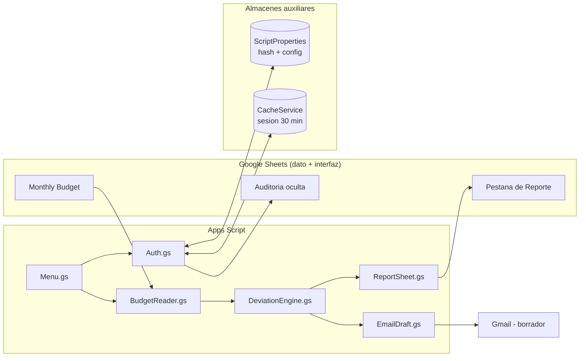
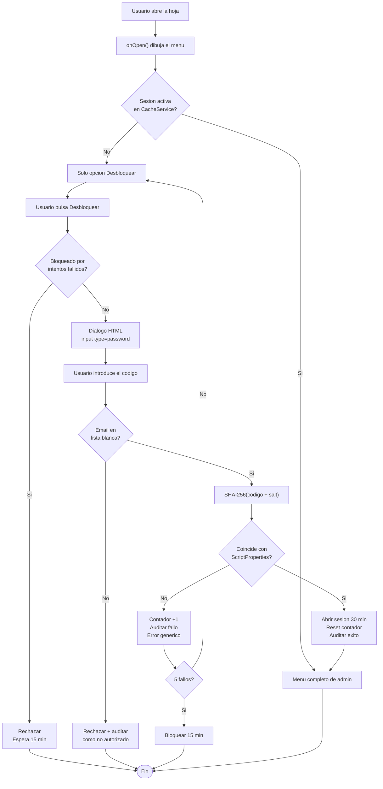
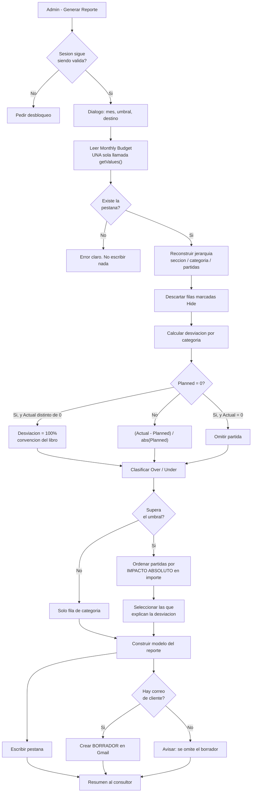
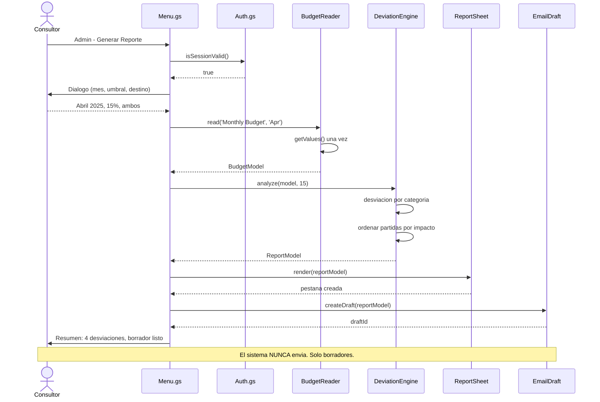
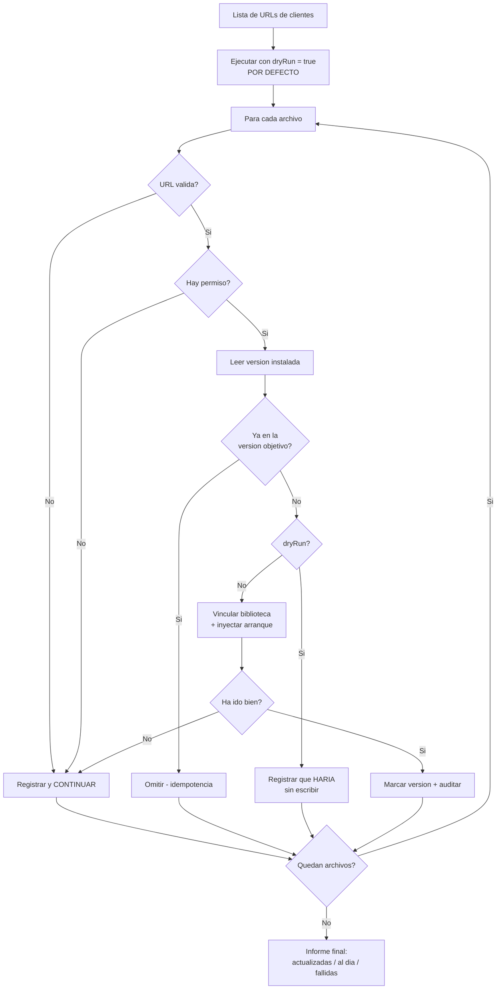
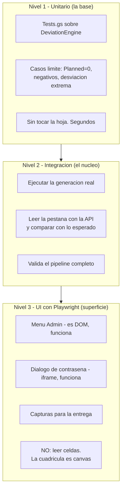

# Diagramas de flujo — Reporte Comparativo Mensual

Diagramas en Mermaid. Se renderizan directamente en GitHub.

---

## 1. Visión general del sistema

**Punto clave:** `DeviationEngine` no toca `SpreadsheetApp` ni `GmailApp`. Recibe datos, devuelve
datos. Por eso se puede probar sin abrir una hoja.

---

## 2. CU-01 · Desbloqueo del menú Admin

---

## 3. CU-02 · Generación del reporte

---

## 4. Secuencia: del clic al borrador

---

## 5. CU-04 · Despliegue masivo (bonus)

**Las tres reglas que hacen esto seguro:** `dryRun` por defecto, idempotencia, y que **un archivo
que falla nunca aborta el lote**.

---

## 6. Estrategia de pruebas

| Nivel | Qué valida | Coste | Fiabilidad |
|---|---|---|---|
| **1 · Unitario** | La lógica de desviaciones y los casos límite | Bajo | Alta |
| **2 · Integración** | Que el pipeline escribe lo correcto | Medio | Alta |
| **3 · Playwright** | Que el menú y el diálogo funcionan; capturas | Alto | Media |

**Por qué Playwright queda arriba y no abajo:** la cuadrícula de Sheets se dibuja en **canvas**, así
que no se pueden leer celdas por selector; y automatizar el **login de Google** dispara detección de
bots y 2FA. Es una herramienta de humo y evidencia visual, no el bucle de desarrollo.
