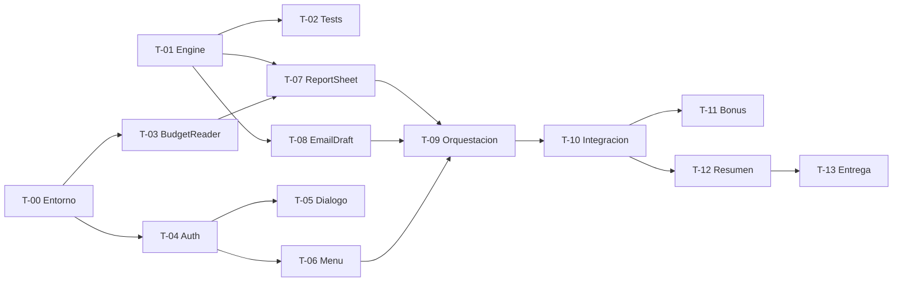

# Plan de tareas

Cada tarea lleva **mínimo dos criterios de aceptación** (regla 2) y **cómo se comprueba cada uno**
(regla 4). Ninguna tarea se da por terminada sin ejecutar su comprobación.

**Leyenda de estado:** ⬜ pendiente · 🟨 en curso · ✅ hecha

---

## Fase 0 · Preparación

### T-00 · Entorno de desarrollo ✅

**Objetivo:** clasp operativo, proyecto de Apps Script vinculado a la copia del usuario.
**Depende de:** que el usuario habilite la API de Apps Script y ejecute `clasp login`.

| # | Criterio de aceptación | Cómo se comprueba |
|---|---|---|
| 1 | Existe un proyecto de Apps Script vinculado a la hoja `1QhR57...` | `clasp create-script --parentId` devuelve un `scriptId`, y `.clasp.json` lo contiene |
| 2 | `clasp push` sube código y se ve en el editor | Push de un archivo trivial y confirmación visual del usuario |
| 3 | `appsscript.json` declara V8 y scopes mínimos | Leer el archivo tras `clasp pull` |

---

## Fase 1 · Núcleo de cálculo

### T-01 · `DeviationEngine.js` ✅

**Objetivo:** lógica pura de cálculo y clasificación de desviaciones. Sin dependencias de Google.
**Depende de:** nada. **Se puede empezar sin `scriptId`.**

| # | Criterio de aceptación | Cómo se comprueba |
|---|---|---|
| 1 | `Planned = 0` y `Actual ≠ 0` → devuelve `100`, nunca `Infinity` ni `NaN` | Test unitario, caso visible en el log de `runAllTests()` |
| 2 | Ordena partidas por **importe absoluto**, no por porcentaje | Test: `Café +300 %/$30` vs `Alquiler +20 %/$600` → Alquiler primero |
| 3 | Importes negativos se tratan como reembolsos válidos | Test con un reembolso (importe real negativo sobre presupuesto positivo) |
| 4 | No importa `SpreadsheetApp` ni `GmailApp` | `grep -E 'SpreadsheetApp\|GmailApp'` sin coincidencias |

### T-02 · `Tests.js` ✅

**Objetivo:** arnés de pruebas ejecutable desde el editor.
**Depende de:** T-01.

| # | Criterio de aceptación | Cómo se comprueba |
|---|---|---|
| 1 | Cubre los **6 casos límite** de `budget-domain-model` | Conteo de tests frente a la tabla de la skill |
| 2 | `runAllTests()` informa cuántos pasan y cuáles fallan | Ejecución con un test roto a propósito: debe reportarlo |
| 3 | Corre sin abrir ninguna hoja | Ejecutar desde el editor sin hoja activa |

---

## Fase 2 · Lectura de datos

### T-03 · `BudgetReader.js` ✅

**Objetivo:** convertir `Monthly Budget` en un modelo de datos limpio.
**Depende de:** T-00.

| # | Criterio de aceptación | Cómo se comprueba |
|---|---|---|
| 1 | Localiza categorías por la etiqueta `Total <X>`, **sin coordenadas fijas** | Insertar una fila arriba en una copia de prueba: debe seguir funcionando |
| 2 | Descarta las filas marcadas `Hide` | Contar partidas devueltas frente a las visibles en la hoja |
| 3 | Una sola llamada `getValues()` | `grep` de `getValue()`/`getRange()` dentro de bucles: sin coincidencias |
| 4 | Descubre categorías no previstas | Añadir una categoría inventada a la hoja: debe aparecer en el modelo |

---

## Fase 3 · Menú Admin y seguridad

### T-04 · `Auth.js` ✅

**Objetivo:** autenticación, sesión, bloqueo y auditoría.
**Depende de:** T-00. **Skill obligatoria:** `apps-script-conventions`.

| # | Criterio de aceptación | Cómo se comprueba |
|---|---|---|
| 1 | Ningún secreto en el código fuente | `grep` de la contraseña en `src/`: cero coincidencias |
| 2 | Guarda `SHA-256(código + salt)`, nunca texto plano | Leer el valor en Script Properties: debe ser un hash |
| 3 | La sesión caduca a los 30 min | Test que manipula el TTL y comprueba que se invalida |
| 4 | A los 5 fallos, bloquea 15 min | Test con 5 intentos fallidos: el sexto se rechaza sin evaluar |
| 5 | Cada intento queda auditado | Revisar la hoja de auditoría tras 1 éxito y 1 fallo |

### T-05 · `AuthDialog.html` ✅

**Objetivo:** diálogo de contraseña enmascarada.
**Depende de:** T-04.

| # | Criterio de aceptación | Cómo se comprueba |
|---|---|---|
| 1 | El campo usa `type="password"` y no muestra lo escrito | **Visual** — captura con Playwright + confirmación del usuario |
| 2 | Un código incorrecto muestra un error genérico | Introducir un código erróneo: no debe revelar detalles |

### T-06 · `Menu.js` ✅

**Objetivo:** menú Admin que refleja el estado de sesión.
**Depende de:** T-04.

| # | Criterio de aceptación | Cómo se comprueba |
|---|---|---|
| 1 | Sin sesión, solo aparece «Desbloquear» | **Visual** — recargar la hoja y observar |
| 2 | Tras desbloquear, aparecen las opciones de admin | **Visual** — Playwright o confirmación del usuario |
| 3 | Toda función de admin revalida la sesión al ejecutarse | Invocar la función desde el editor sin sesión: debe rechazar |

---

## Fase 4 · Salidas

### T-07 · `ReportSheet.js` ✅

**Objetivo:** pintar la pestaña con el formato de referencia del libro.
**Depende de:** T-01, T-03.

| # | Criterio de aceptación | Cómo se comprueba |
|---|---|---|
| 1 | Columnas idénticas a las de los reportes existentes | Comparar cabecera contra la pestaña de Abril del libro |
| 2 | Fila de categoría con `Status`; filas de partida con `Status` vacío | Leer la pestaña generada y comparar |
| 3 | Fila en blanco entre categorías | Ídem |
| 4 | Desviación en importe con signo explícito (`+`/`-`) | Ídem |

### T-08 · `EmailDraft.js` ✅

**Objetivo:** borrador de Gmail en lenguaje llano.
**Depende de:** T-01.

| # | Criterio de aceptación | Cómo se comprueba |
|---|---|---|
| 1 | Crea **borrador**, nunca envía | Scope `gmail.compose` (no permite enviar) + revisar Enviados: vacío |
| 2 | Explica la causa, no solo enumera cifras | Revisión del texto generado sobre los datos de Abril |
| 3 | Ingresos y gastos se describen con lenguaje distinto | Caso `Person 1 -90 %` (malo) vs `Shelter -84 %` (bueno) |
| 4 | Señala los ahorros engañosos | Caso de gasto grande sin cargar (actual 0, presupuesto alto): debe advertir del cargo pendiente |

---

## Fase 5 · Integración

### T-09 · Orquestación ✅

**Objetivo:** unir todo tras el clic de menú, con diálogo de parámetros.
**Depende de:** T-03, T-06, T-07, T-08.

| # | Criterio de aceptación | Cómo se comprueba |
|---|---|---|
| 1 | Mes por defecto = el del selector de la hoja | Cambiar el selector y abrir el diálogo |
| 2 | Umbral configurable, 15 % por defecto | Generar con 15 % y con 50 %: distinto número de desviaciones |
| 3 | Si falta la pestaña, error claro y no escribe nada | Renombrar la pestaña en una copia y ejecutar |

### T-10 · Prueba de integración end-to-end ✅

**Objetivo:** verificar el pipeline completo sobre datos reales.
**Depende de:** T-09.

| # | Criterio de aceptación | Cómo se comprueba |
|---|---|---|
| 1 | El reporte de Abril reproduce los valores del ejemplo del libro | Comparar celda a celda leyendo la pestaña por API |
| 2 | Cada categoría coincide en importe y porcentaje con la pestaña de referencia del mismo mes | Comparar la pestaña generada contra `<Mes> Budget Comparison` **en ejecución**, sin versionar las cifras |
| 3 | Ninguna celda contiene `NaN`, `Infinity` ni `#DIV/0!` | Barrido de la pestaña generada |

---

## Fase 6 · Bonus

### T-11 · Despliegue masivo mediante biblioteca compartida 🟨

> **Ficha reescrita.** La versión anterior decía «actualizar N hojas de clientes», lo que sugiere
> recorrer hojas con `SpreadsheetApp`. El enunciado pide algo distinto y más concreto: **vincular
> cada archivo de cliente a una Master Script Library e inyectar programáticamente el menú Admin y
> el código de configuración**. Eso no se hace con `SpreadsheetApp`, sino con la **Apps Script API**.

**Objetivo:** dado un listado de URLs de hojas de cliente, dejar cada una vinculada a la biblioteca
compartida y con el código de arranque inyectado.

**Depende de:** T-09, y de decisiones de infraestructura que **requieren al usuario**.

#### Lo que cambia respecto a lo ya construido

| Aspecto | Estado actual | Lo que exige T-11 |
|---|---|---|
| Mecanismo | `SpreadsheetApp` sobre la hoja activa | `script.projects.updateContent` de la **Apps Script API** |
| Manifiesto | Sin `dependencies` | `dependencies.libraries` apuntando a la Master Script Library |
| Scope de hojas | `spreadsheets.currentonly` | **Impide por diseño abrir hojas de otros clientes.** Habría que ampliarlo |
| Scopes nuevos | — | `script.projects`, `drive.readonly` o equivalente |
| Infraestructura | Ninguna | Un **proyecto de GCP propio** con la Apps Script API habilitada |
| Naturaleza | Script vinculado a una hoja | Proyecto **standalone** independiente |

#### Decisión de arquitectura a documentar

Existen dos caminos y conviene presentar ambos:

1. **Inyección de código vía Apps Script API** — es lo que pide el enunciado y sirve para el parque
   de copias que ya existen.
2. **Editor Add-on del Workspace** — es la respuesta correcta a escala: se instala una vez y todas
   las copias lo tienen, sin volver a tocar archivo por archivo.

Lo que demuestra criterio es plantear el add-on como destino y la inyección como puente.

#### Criterios de aceptación

| # | Criterio de aceptación | Cómo se comprueba |
|---|---|---|
| 1 | El manifiesto del cliente queda con `dependencies.libraries` apuntando a la biblioteca | Leer el manifiesto tras el despliegue y verificar la entrada |
| 2 | El código de arranque (menú Admin) queda inyectado y `onOpen` funciona | Abrir una hoja de prueba y ver el menú |
| 3 | `dryRun = true` por defecto | Ejecutar sin argumentos: no escribe nada, solo informa qué haría |
| 4 | Idempotente | Ejecutar dos veces: el segundo pase reporta «ya al día» sin duplicar dependencias |
| 5 | Un archivo que falla no aborta el lote | Incluir una URL inválida y una sin permisos: los demás se procesan |
| 6 | Informe final con actualizadas / al día / fallidas y el motivo | Revisar la salida |

#### Bloqueantes antes de escribir código

1. **¿Existe ya la Master Script Library?** Se necesita su `scriptId` y su número de versión.
   El enunciado dice «tendrás acceso», luego es un supuesto a declarar si no se facilita.
2. **Proyecto de GCP** con la Apps Script API habilitada, y el script asociado a él.
3. **Ampliar los scopes** del proyecto de despliegue — que debe ser **standalone**, no el script
   vinculado a la hoja, para no ensuciar los permisos del que usa el cliente.

Mientras 1 y 2 no estén resueltos, lo entregable es el **código con supuestos declarados** y una
prueba sobre una copia propia, no un despliegue real sobre clientes.

---

## Fase 7 · Entrega

### T-12 · Resumen para el fundador ✅

**Objetivo:** explicar el enfoque a alguien sin perfil técnico. **Es un entregable evaluado.**
**Depende de:** todo.

| # | Criterio de aceptación | Cómo se comprueba |
|---|---|---|
| 1 | Sin jerga técnica sin explicar | Lectura crítica: ningún término sin traducir |
| 2 | Cuantifica el valor de negocio (tiempo ahorrado por cliente y mes) | El documento contiene la cifra y su razonamiento |
| 3 | Declara los supuestos tomados | Contrastar con los supuestos registrados en `docs/` |
| 4 | Es honesto sobre los límites del control de acceso | El documento distingue barrera de UX frente a control de seguridad |

### T-13 · Empaquetado 🟨

**Objetivo:** carpeta de Drive lista para enviar.

| # | Criterio de aceptación | Cómo se comprueba |
|---|---|---|
| 1 | La carpeta contiene hoja, acceso al código y resumen | Revisión de la carpeta |
| 2 | Ningún dato de cliente en el repositorio público | `git log` + revisión de archivos versionados |

---

## Orden de ejecución

**T-01 y T-02 no dependen de nada** y son el núcleo evaluable: se empiezan de inmediato, en paralelo
a la configuración del entorno.
